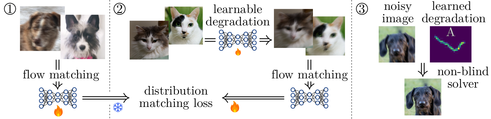

# DDM4IP

[Arxiv version of the article]()

This repository implement the code for the article: **Unsupervised Imaging Inverse Problems with Diffusion Distribution Matching**.




## Abstract
This work addresses image restoration tasks through the lens of inverse problems using unpaired datasets. In contrast to traditional approaches—which typically assume full knowledge of the forward model or access to paired degraded and ground-truth images—the proposed method operates under minimal assumptions and relies only on small, unpaired datasets. This makes it particularly well-suited for real-world scenarios, where the forward model is often unknown or mis-specified, and collecting paired data is costly or infeasible.
The method leverages conditional flow matching to model the distribution of degraded observations, while simultaneously learning the forward model via a distribution-matching loss that arises naturally from the framework.
Empirically, it outperforms both single-image blind and unsupervised approaches on deblurring and non-uniform point spread function (PSF) calibration tasks. It also matches state-of-the-art performance on blind super-resolution.
We also showcase the effectiveness of our method with a proof of concept for lens calibration: a real-world application traditionally requiring time-
consuming experiments and specialized equipment. In contrast, our approach achieves this with minimal data acquisition effort.

## Setup & Installation

Install requirements:
 1. Install pytorch (tested with v2.4, but anything newer than v2.1 should work)
 2. Install pre-requisites `pip install -r requirements.txt

Clone repository
```bash
git clone https://github.com/inria-thoth/ddm4ip
```

## Dataset Preparation

Several datasets were used in the paper. Here are some basic instructions which help reproduce our results.
1. **FFHQ**
    Download the data from [here](https://github.com/NVlabs/ffhq-dataset), then run (feel free to change the output path to whatever is convenient)
    ```bash
    python scripts/preprocess_ffhq.py --input-path=images1024x1024.zip --output-path=datasets/ffhq/
    ```
2. **DIV2K**
    Simply running the preprocessing script will also download the necessary data
    ```bash
    python scripts/preprocess_div2k.py --path=./datasets/div2k/
    ```
3. **DDPD**
    Download the data from [here](https://github.com/Abdullah-Abuolaim/defocus-deblurring-dual-pixel), then run the preprocessing script.
    ```bash
    python scripts/preprocess_ddpd.py --input-path=dd_dp_dataset_canon.zip --output-path=datasets/ddpd/
    ```
4. **Parking lot**
    Download the data and unzip it to directory `datasets/parkinglot/`, then run the preprocessing script
    ```bash
    python scripts/preprocess_parkinglot.py --path=datasets/parkinglot/ --preprocess
    ```
    the preprocessed data will be stored in zip files within the same directory.

## Reproducing Experiments

We will assume you wish to save intermediate results and checkpoints in a directory stored in variable `$RESULTS_DIR` (e.g. run `export RESULTS_DIR=./results`), and that the dataset directory is in variable `$DATA_DIR` (for example `export DATA_DIR=./datasets`).


### 1. FFHQ Experiment

This experiment consists of recovering a single motion-blur kernel by training on 1000 noisy and 100 clean unpaired images from FFHQ (downsampled at 256-pixel resolution). After having downloaded the data, the experiment consists of two steps to estimate the blur kernel and a third to perform model inversion.

**Step 1**
Note that metrics, training diagnostics will be produced and saved as tensorboard logs within the `$RESULTS_DIR` directory. Checkpoints will also be saved at regular intervals so that training can be restarted. Check the [configuration file](configs/exp/step1_ffhq.yaml) for more details about various options.
```bash
python main.py exp=step1_ffhq +paths.data=$DATA_DIR +paths.out_path=$RESULTS_DIR
```

**Step 2**
This step assumes that the first step has run, and a model has been saved at `$RESULTS_DIR/flowxxxs_ffhq256-0-1000_mb32_ns0.02_lr1e-2/checkpoints/training-state-4194304.pt`. If this is not the case, check the configuration for the first step.
```bash
python main.py exp=step2_ffhq +paths.data=$DATA_DIR +paths.out_path=$RESULTS_DIR
```

**Step 3**
The final step runs model inversion on a separate FFHQ test-set in the non-blind setting using the blur-kernel learned in step 2. Reconstructed images will be saved in the results directory.
Once again this step depends on the step-2 model file being available at `$RESULTS_DIR/diy_tr1k_ffhq256-5000-5100_motionblur_noise0.02_direct/checkpoints/network-snapshot-1048576.pkl`
```bash
python main.py exp=step3_ffhq +paths.data=$DATA_DIR +paths.out_path=$RESULTS_DIR
```

### 2. Non-uniform blur Experiment

The PSFs can either be generated from scratch, by downloading the real-world PSF dataset [here](https://edmond.mpg.de/dataset.xhtml?persistentId=doi:10.17617/3.4OIMWN) and then running `python scripts/get_spacevarying_psf.py`, or we provide the pre-generated data at [data/8x8_realpsf_27.pt](data/8x8_realpsf_27.pt).


### 3. Parking lot Experiment

Start by downloading and preprocessing the data. The experiment then consists of the following three steps, which end with the cleaned f/16.0 dataset.
The environment variables are very similar to FFHQ and the non-uniform blur experiments

**Step 1**
```bash
python main.py exp=step1_parkinglot +paths.data=$DATA_DIR +paths.out_path=$RESULTS_DIR
```

**Step 2**
This step assumes a model has been saved at `$RESULTS_DIR/ft_flowxxxs_plot16_ps64_lr1e-2/checkpoints/training-state-16777216.pt`
```bash
python main.py exp=step2_parkinglot +paths.data=$DATA_DIR +paths.out_path=$RESULTS_DIR
```

**Step 3**
This step assumes a model has been saved at `$RESULTS_DIR/di_plot_16-to-5.6-center_8-psfs/checkpoints/network-snapshot-6291456.pkl`
```bash
python main.py exp=step3_parkinglot +paths.data=$DATA_DIR +paths.out_path=$RESULTS_DIR
```
The deblurred images will be saved in `$RESULTS/di_plot_16-to-5.6-center_8-psfs/plots`.


### 4. Super-resolution experiments

Check the [relevant readme](scripts/superresolution/README.md) for detailed instructions on how to run the various baseline experiments.

To run DDM4IP on the full [DIV2KRK dataset](https://www.wisdom.weizmann.ac.il/~vision/kernelgan/), follow these steps:
 1. Download the data from [here](https://www.wisdom.weizmann.ac.il/~vision/kernelgan/), unzip it and set environment variable `DATA_DIR` to the unzipped data root.
 2. Clone KernelGAN in the `scripts/superresolution` directory. We will use ZSSR implemented in the repository.
 ```bash
cd scripts/superresolution
git clone https://github.com/sefibk/KernelGAN.git
 ```
 3. Set the environment variable `OUTPUT_DIR` to some directory where results will be saved
 4. Run the following script
 ```bash
cd scripts/superresolution
./run_all_ddm4ip.sh
 ```

## Baselines

Several baselines were used in the paper.
Most of them should be runnable following instructions within this repository. If there is a particular baseline you would like to see, and for which no instructions have been published please let us know by filing an issue.

 - For FFHQ motion-deblurring baselines check [this readme](scripts/blur_baselines/readme.md)
 - For super-resolution baselines check [the relevant readme](scripts/superresolution/README.md)
 - For parking-lot baselines check [this notebook](notebooks/EboliFast.ipynb)


## Citing us

If you find the paper useful for your own research, please remember to cite our work:

```bibtex

```